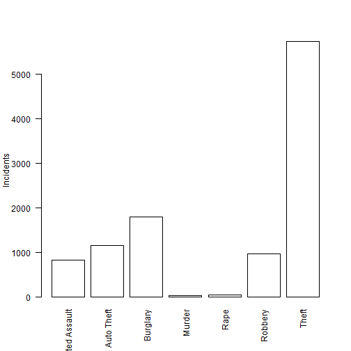

Data Products Project
========================================================
author: Michael W Newlin
date: February 22, 2015
transition: linear

Houston Crime Data App - Slide 1
========================================================

The application presents reported crime date for December 2014.

[Houston Police Stats](http://www.houstontx.gov/police/cs/stats2.htm)

Types of offense types reported:

***
* Aggravated Assault
* Auto Theft
* Burglary
* Murder
* Rape
* Robbery
* Theft

Houston Crime Data App - Slide 2
========================================================
transition: rotate
incremental: true

Charts available:

* Offense Type
* Incidents by hour of day

Houston Crime Data App - Slide 3
========================================================

Bar plot of the frequency of Offense Types

 

Houston Crime Data App - Slide 4
========================================================
incremental: true

A filter panel allows the user to filter on the following items:

* Reported incident date
* Offense type
* Chart type

Houston Crime Data App - Slide 5
========================================================
type: prompt

Filterable and sortable data columns available:
* Date
* Hour
* Offense.Type
* Beat

***
* Premise
* BlockRange
* StreetName
* Type
* Suffix
* Offenses

